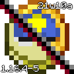

# Resource Backport
 A resource pack for Minecraft that backports snapshot resources
 
 

Created for both Minecraft Java and Bedrock editions

If this is agaist the EULA I can take it down if needed
